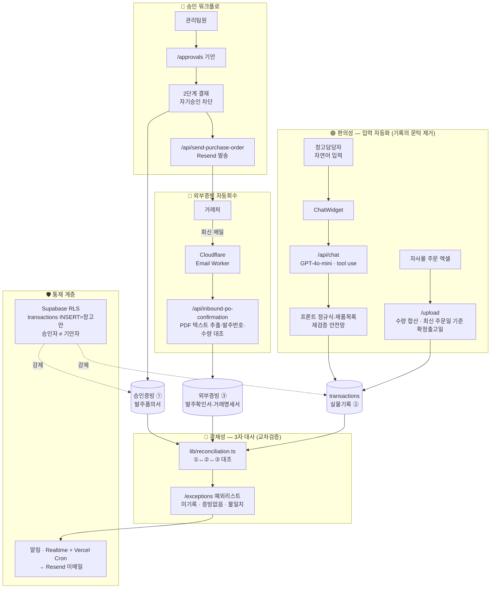

# 재고관리 AI

> 현장 인력(창고담당자)의 **편의성**을 고려하는 동시에, **증빙 대사를 통해 실시간 입출고 기록을 지원**하는 재고관리 Tool입니다.

**🔗 라이브 데모** · https://inventory-ai-finish.vercel.app/
**💻 데모 계정** · [바로가기](#데모-계정)

`Next.js` · `Supabase` · `Vercel` · `Cloudflare` · `Resend` · `OpenAI`

---

##  Pain point
> **"소수의 창고 인력으로 인한 실시간 재고 데이터의 공백/ 정확한 재고가치 산정의 어려움"**

* **인력 부족 및 기록 누락** : 창고인력 부족으로 인한 실시간 입출고 기록 지연/누락 발생
* **데이터 파편화** : 메신저를 통한 입출고 공유로 데이터 신뢰도 하락 및 추적 불가
* **월중 재고관리 부재** : 월말 실사에만 의존해 발주 타이밍 상실, 불일치 차이값 소명 불가 등 리스크 노출

---

##  해결 방안 (Main Idea & System)
> **"현장 편의성 극대화 + 3자 대사(교차 검증)를 통한 실시간 재고 신뢰성 확보"**

* **현장 업무 자동화 (편의성)** : 자연어 기반 인터페이스 chat, 엑셀 수량 자동 인식, 이메일 증빙 자동 수집을 지원하여 1인 창고 담당자의 편의성 지원
* **3자 대사 교차 검증 (데이터 신뢰성)** : `내부 증빙(발주품의서/출고지시서)` ↔ `실물 기록(입출고)` ↔ `외부 증빙(발주/집하 확인서)` 3단 대조를 통해 서류 간 정합성을 검증하고, 실시간 재고 데이터의 무결성을 확보
* **역할 분리 및 스마트 알림 (리스크 통제)** : 본사와 창고의 역할을 분리하고, 증빙 누락 시 실시간 알림(Supabase Realtime)을 발송하여 인적 오류 차단


---

##  핵심 설계 원칙 — 3자 대사로 기록에 강제성 부여

```
① 승인 증빙(발주품의서·출고지시서)  ←→  ② 실물기록(입출고)  ←→  ③ 외부증빙(거래명세서·운송장)
          "지시된 수량"                "실제 움직인 수량"           "제3자가 확인한 수량"
```

- **①↔②** 승인된 수량과 실제 입출고 수량이 맞는가
- **②↔③** 실물기록에 외부증빙이 붙어있고 그 수량이 맞는가

---

##  핵심 설계 원칙 ② — 입력 자동화로 담당자의 편의성 증대

> 사람이 입력을 미루면 기록에 공백이 생기는 문제점을 예방하기 위해, **자연어·엑셀·이메일을 구조화된 기록으로 자동 변환**해 기록 부담을 최소화 

```
자연어 chat    →  GPT 의도추출   →  정규식·제품목록 재검증    →  입출고 기록
자사몰 엑셀     →  수량 자동합산   →  "엑셀 내 최신 주문일시" 기준 →  확정 출고일
거래처 회신메일  →  Worker 수신    →  PDF 발주번호·수량 대조     →  외부증빙 자동첨부
```

- **자연어 기반 인터페이스** — "핸드로션 30개 올영 출고" → 채널·사유·창고·로트까지 구조화. GPT 출력은 그대로 믿지 않고 프론트 정규식·제품목록으로 재검증(무사유 반출·미등록 채널 차단).
- **엑셀은 자동인식** — 자사몰 주문 엑셀에서 상품별 수량을 합산하고, 제출 시각이 아닌 "엑셀 내 최신 주문일시" 기준으로 확정 출고일을 계산.
- **증빙의 자동회수 시스템** — 거래처가 회신하면 사람 개입 없이 PDF 발주번호·수량을 대조해 문서에 자동 반영. 회신이 없으면 수동 확정 + 리마인드로 안전망.

> **편의성이 만든 기록을 강제성(3자 대사)이 다시 검증하는 system**

---


##  데모 계정

| 역할 | 이메일 | 비밀번호 |
|---|---|---|
| 관리팀원 (기안) | rldks@test.com | 222222 |
| 관리책임자 (승인) | tmddls@test.com | 333333 |
| 창고담당자 (입출고) | ckdrh@test.com | 111111 |


**테스트 방향**
1. 관리팀원으로 로그인 → `/결재`에서 발주품의서 기안
2. 관리책임자로 로그인 → 해당 건 승인 → "발주서 발송"
3. 발송완료 화면에서 발주번호·발송시각 확인
4. 창고담당자로 로그인 → 입고 실물기록 → 예외리스트에서 대조 상태 확인

> 📧 발주 메일은 시스템 소유 메일함으로 발송되어 테스트시 직접 수신을 확인하기 어렵습니다 — 거래처 수신·회신 흐름은 아래 [화면](#주요-기능-및-화면)의 스크린샷으로 대체했습니다.

---

##  주요 기능 및 화면

* **2단계 전자결재 + 자기승인 차단** 
  기안→승인 결재선. 본인이 기안한 문서는 본인이 승인할 수 없도록 합니다.

* **발주확인서 자동회수 및 검증**
  거래처가 회신 메일로 발주확인서를 보내면, 사람 개입 없이 **PDF를 검증해 문서에 자동 반영**합니다. 회신이 없으면 수동 확정 + 리마인드로 안전망을 둡니다.
  
 | 발주 발송 | 거래처 수신 | 거래처 회신 |
| :--- | :--- | :--- |
|  |  |  |

| 발주번호 자동인식-불일치시, 알림 | 일치시, 알림 | 발주확인서 자동첨부 |
| :--- | :--- | :--- |
|  |  |  |


  

* **3자 대조 예외리스트** 
  결재·실물·증빙이 어긋나는 건을 기한초과 미기록, 증빙 없음, 증빙 불일치 등으로 분류해 한눈에 보여줍니다.
<details>
<summary>기능 상세 더보기</summary>

- **출고 확정일 자동계산** — 자사몰 주문 엑셀에서 상품별 수량을 합산하고, 제출 시각이 아닌 "엑셀 내 최신 주문일시" 기준으로 확정 출고일을 계산합니다.
- **예상 출고 로트 미리보기** — 승인 문서 상세에서 FIFO 기준으로 어떤 로트가 나갈지 미리 보여줍니다(임박·만료 로트 제외).
- **내부사용 이중 점검** — 매주 월요일 주간요약 + 월말 확인(마지막 3일)으로, 내부반출은 2중으로 확인할수 있도록 설정합니다. 
- **자동 알림** — 실시간 알림함(Supabase Realtime) + 앱을 안 켜도 매일 도는 이메일 알림(Vercel Cron).

</details>

##  기술 파이프라인


---

##  기술 스택

| 기술 | 용도 / 선택 이유 |
|---|---|
| **Next.js** (App Router, TypeScript) | 화면(프론트엔드)과 백엔드(서버)를 하나의 프로젝트로 다룰 수 있는 풀스택 프레임워크 |
| **Supabase** (Auth/RLS/DB) | 데이터를 저장하는 DB이면서, RLS를 통한 내부 통제 설계 |
| **Vercel** (배포/Cron) | 프로젝트 배포, Cron으로 자동 이메일 알림(내부반출 이메일)|
| **Cloudflare** (Email Routing + Worker) | Vercel이 이메일을 받을 수 있도록, Cloudflare가 **거래처 회신 메일을 받아 HTTP 요청으로 변환**해줌.|
| **Resend** | 발주서·알림 이메일 발송 |
| **OpenAI** (gpt-4o-mini) | 자연어 입출고 명령의 의도 추출용. **GPT 출력을 그대로 신뢰하지 않고** 프론트 정규식·제품목록 대조로 재검증하는 안전망을 이중으로 둠 |

---

##  보안 · 통제 (RLS)

단순한 프론트엔드(화면) 통제의 한계를 개선하고, DB에서 보안 체계를 구축했습니다.

* **UI 제어의 한계 극복:** 화면 버튼 비활성화(`disabled`) 우회 및 API 직접 호출(Postman 등) 취약점 발견.
* **DB 레벨 접근 통제 (RLS):** 전 테이블에 RLS를 도입하여,'DB'에서의 권한 및 데이터 격리 강제.
* **초대코드 기반 회원가입:** RLS 정책의 실효성을 위해, 회원가입 시점에 검증된 초대코드 소지자만 특정 회사 및 권한으로 매핑되도록 설계.

### 🛡️ 주요 RLS 정책 (Policy) 적용 명세
화면이 아닌 DB가 직접 요청을 검증하고 차단하는 핵심 정책입니다.

| 테이블 | 데이터 | RLS 정책 예시 (Policy) |
| :--- | :--- | :--- |
| `transactions` | 입출고 기록 | **INSERT/DELETE는 '창고' 역할만 가능** (권한 외 기록 원천 차단) |
| `approval_steps` | 결재 내역 | **UPDATE 시 승인자 ≠ 기안자** (API를 통한 자기승인 우회 차단) |


